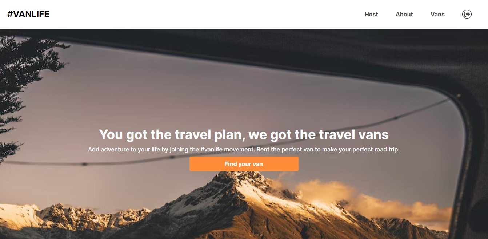
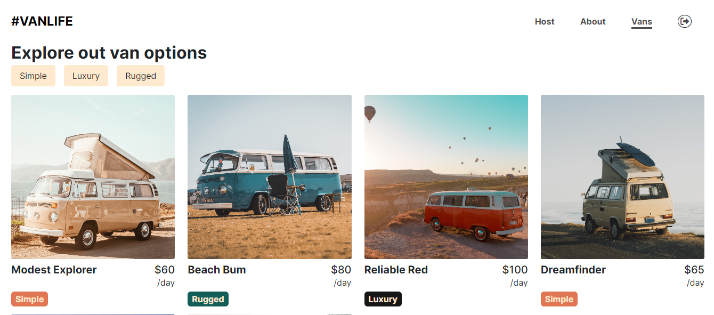
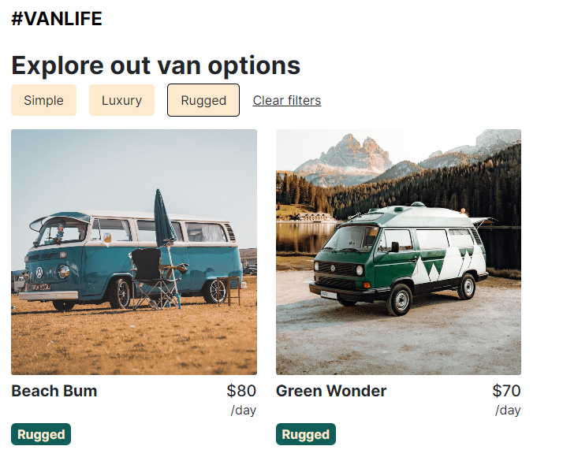
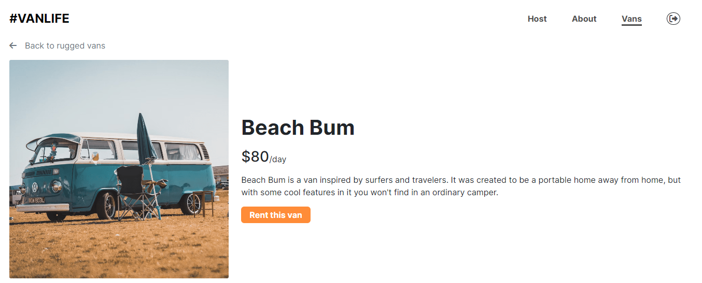
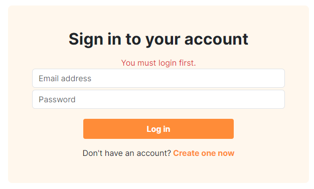
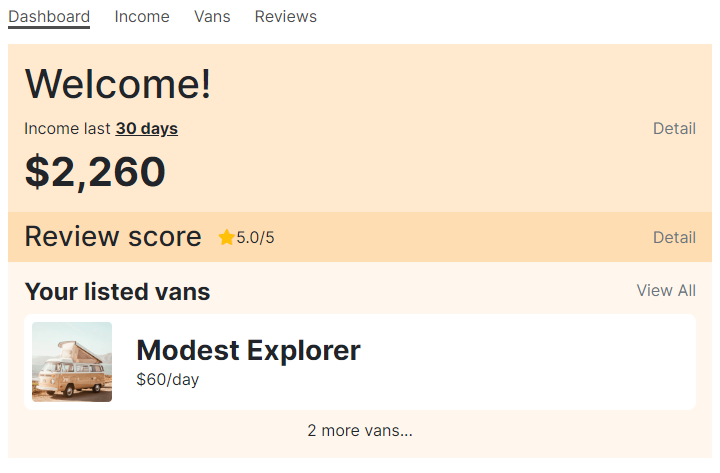
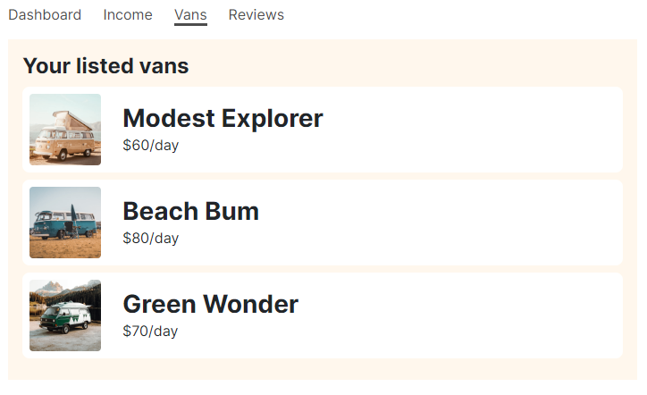
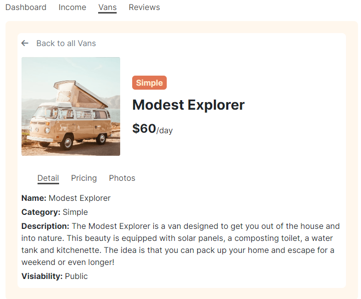

**" You got the travel plan, we got the travel vans "**

VanLife is a web app to help people find their best van for a memorible trip.

# Overview
This project is a client-side based website represents a van booking site for people to book a suitable van for their trip. It uses mostly frontend techs like: HTML/CSS, Bootstrap, Javascript, React and React Router. The backend side uses mirageJS for a mock server.

# Features and ScreenShots
* Main page

* Vans listing 

* Filter vans list

* Checking van info

* Login/Logout: require login to access to Host

* After login, user can check for some information in the host page

# Tech Stack
**Frontend**
* [React](https://react.dev/)
* [React Router 6](https://reactrouter.com/en/main) - Routing with hooks like useRoutes, useLoaderData
* Bootstrap - Styling and responsive design
* HTML/CSS - Markup and styling

**Backend**
* mirageJS - API mocking

The core of the frontend is built with React and React Router 6 for routing and navigation. Key React Router hooks like useRoutes, useLoaderData and Link/NavLink, ... are used.

Bootstrap provides responsive design and styling capabilities out of the box.

The backend uses mirageJS to mock APIs and provide fake data for prototyping.

# Installation 
1. Clone the repo
2. Install all dependencies with `npm install` or (`npm i && npm run dev`)
3. Start development server with `npm start`

# Contact me at
* Your Name: **Khoa Nguyen**
* Email: nlydkhoa1024@gmail.com
* LinkedIn: https://www.linkedin.com/in/khoa-nguyen-ly/

